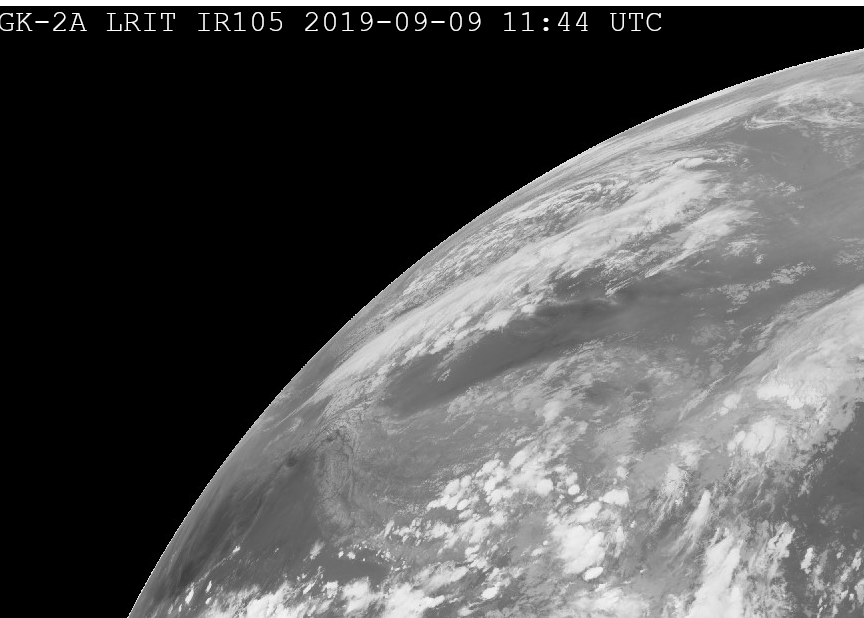
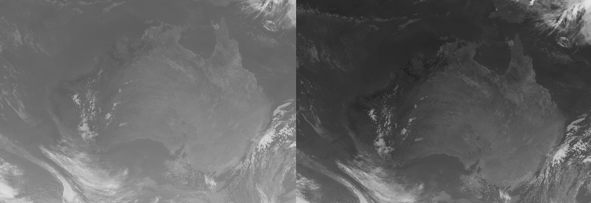
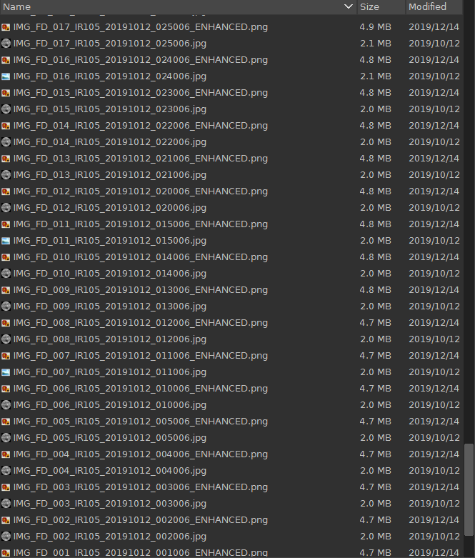
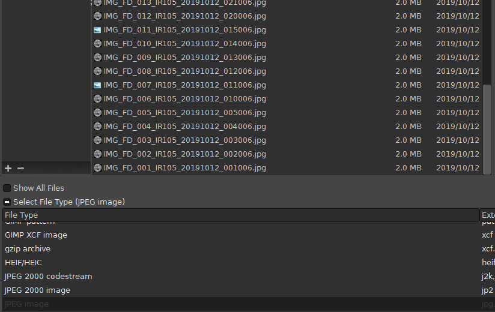

# GIMP Plugins for GK-2A
Apply overlays and underlays automatically to GK-2A IR images in GIMP.

GK-2A created by the KMA Meterological Organisation is a geostationary satellite transmitting both LRIT and HRIT. The aim of these plugins is to automatically add overlays and underlays to the (now only available) monochrome IR images when they are opened as layers. To use these plug-ins require the host software GIMP editor to be installed. 

## Options
Plugin | In GIMP | Input |
------------ | ------------- | ------------- |
GK2A_Date and Time.py | Apply date and time to layers for animation | None 
GK2A_Auto_Adjust.py | auto adjust layers for animation | None
GK2A_enhancement_overlay.py | Apply IR enhancement to layers for animation | None
GK2A_overlay.py | Apply overlay to layers for animation | Path to overlay file (.gif)
GK2A_underlay.py | Apply underlay to layers for animation | Path to underlay file (bitmap image)

## Adding date and time
This plug-in extracts the time information from the file name and stamps it on the image/layer. Open all the IR images as layers (select "Open as layers" from the File menu)

## Auto adjust - Tries to emphasize the land
This plug-in increases contrast between land and sea.

## Applying the GK-2A IR enhancement overlay
Using the IR enhancement tool developed by Sam (https://github.com/sam210723/xrit-rx), you can create the corresponding IR enhancement for the IR image. Make sure you set the option to transparent when creating the IR enhancement images and allow it to generate all the IR enhancement for every image in your output folder. Like this:

In GIMP, open all the IR images as layers. Filter to just show jpeg files in the folder (it will be easier to select all the IR jpg)

